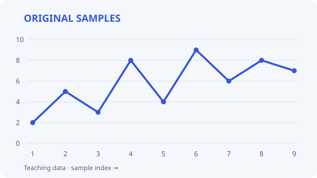
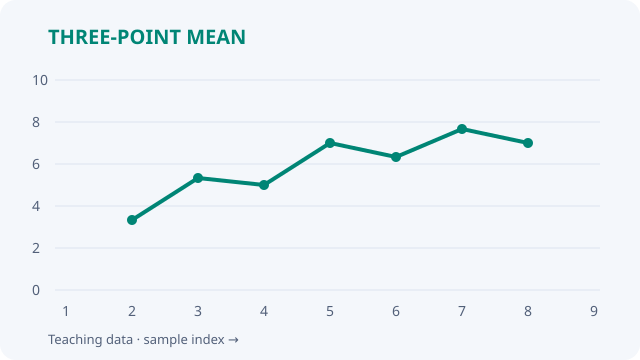

# 一份会排版的实验笔记

用同一组**教学用采样值** `[2, 5, 3, 8, 4, 9, 6, 8, 7]`，记录三点移动平均。下面的图、视频和数字都来自这组数据，示例素材随插件提供，可离线使用。

**先试一次：** 创建示例笔记 → 切到实时预览 → 拖动两图间隙。阅读模式用于查看，实时预览用于调整。

## 1 · 并排比较，差异一眼可见

实验前后、设计迭代和截图对照，都适合把图放在同一行。

<!-- vml {"v":2,"rows":[{"height":190,"widths":[1,1],"captions":["原始采样。 {#fig:raw}","三点平均，端点不计算。 {#fig:mean}"]}]} -->
 
<!-- /vml -->

**试试：** 拖中间间隙改比例，拖行底边改高度；拖图片交换顺序或移到新行。每行最多 4 项，可多行组成图集；普通图片也能拖进已有布局。右键编辑图注与对齐方式。

## 2 · 图旁写结论，解释紧随证据

<!-- vml {"v":2,"width":0.55,"valign":"center","rows":[{"width":1}]} -->

### 平滑有代价
原始峰值是 **9**，对应窗口的平均值是 **6.33**。波动减弱，但峰值也被压低：报告结论时，应同时保留原图。
<!-- /vml -->

**试试：** 点击右侧文字直接编辑，Esc 结束；右键图片添加左栏，或把文字改为顶部／中间／底部对齐。文字支持 Markdown、列表、任务、链接、公式及你的格式快捷键。

## 3 · 环绕与旁注，把短提醒放在上下文中

<!-- vml {"v":2,"type":"text","wrap":"right","width":0.32,"size":0.9} -->
**边界处理**

这里只计算第 2～8 个采样点。两端没有完整窗口，留空，不补零。
<!-- /vml -->
移动平均用相邻三个值的均值替换中间值，适合在学习记录中观察局部波动。它不能证明测量更准确，也不能代替对异常点的检查。右侧旁注解释了两端为什么没有结果，正文读完后继续占满行宽。

**试试：** 图片也可右键设为左／右环绕。拖外框上方的手柄移动整块：正文中部放在段落之间，左右区域设为环绕；落点决定从哪里开始。拖外框边缘改宽度，角落等比缩放；单图可水平拖动并吸附到左、中、右。Esc 取消拖动。

## 4 · 分栏、公式与引用，写清实验方法

<!-- vml {"v":2,"type":"text","cols":2,"gap":1.5} -->
### 方法

对内部采样点使用：

$$
y_t=\frac{x_{t-1}+x_t+x_{t+1}}{3}\label{eq:mean}
$$

如 @fig:raw 和 @fig:mean 所示，@eq:mean 减小了局部起伏。以下代码保留完整窗口对应的七个结果：

```python
x = [2, 5, 3, 8, 4, 9, 6, 8, 7]
y = [sum(x[i-1:i+2]) / 3
     for i in range(1, len(x)-1)]
```

### 核对

| 采样点 | 原值 | 平均值 |
| --- | ---: | ---: |
| 2 | 5 | 3.33 |
| 4 | 8 | 5.00 |
| 6 | 9 | 6.33 |

三个窗口的核对值。 {#tbl:check}

@tbl:check 用于检查计算，不把平滑程度当作准确率。编辑文字时暂时显示为一栏，结束后恢复分栏。
<!-- /vml -->

**试试：** 右键文字块 →「文字设置」，改为 2～4 栏，调整栏距、字号、对齐及块的位置。窄屏更适合单栏。

**编号写法：** 图注末尾写 `{#fig:name}`，表注末尾写 `{#tbl:name}`，公式里写 `\label{eq:name}`；正文用 `@fig:name`、`@tbl:name`、`@eq:name` 引用，点击可跳转。编号按本篇笔记排序，设置中可选中文或英文。

## 5 · 视频与静图一起保留过程

<!-- vml {"v":2,"rows":[{"height":190,"widths":[1,1],"captions":["逐点移动的三点窗口（教学动画）。","原始采样，便于暂停核对。"]}]} -->
 
<!-- /vml -->

**试试：** 播放动画，再用视频左上角的专用手柄移动它，播放控件仍可正常操作。实时预览中双击图片放大查看，滚轮缩放、拖动平移、方向键切图。

## 带回自己的笔记

| 要做什么 | 最短路径 |
| --- | --- |
| 开始排版 | 选中文字／媒体行，右键「把选中的内容包成布局块」，或用同名命令；普通图片也有右键入口 |
| 连续整理素材 | 设置中按需开启拖入／粘贴后的自动转换（默认关闭） |
| 合并或还原 | 命令「与下一个布局块合并」；右键移出单项，或移除布局注释保留内容 |
| 查看源码、撤销调整 | 点击「编辑源码」；用 Obsidian 原生撤销／重做 |
| 分享排版 | 切换阅读模式，或使用 Obsidian「导出为 PDF」；纸张宽度会影响换行和分页 |
| 再看示例 | 命令面板搜索「功能示例」；快捷键可在 Obsidian 设置中自行绑定 |

布局保存在 HTML 注释中，媒体仍是普通嵌入。停用插件后内容保留，按普通 Markdown 上下排列；布局与自动编号需要插件。示例中的文件可自由替换为你自己的素材。
