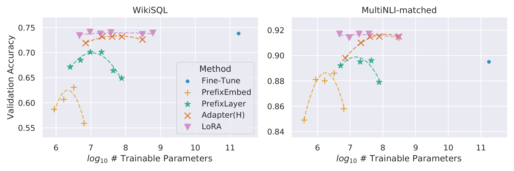
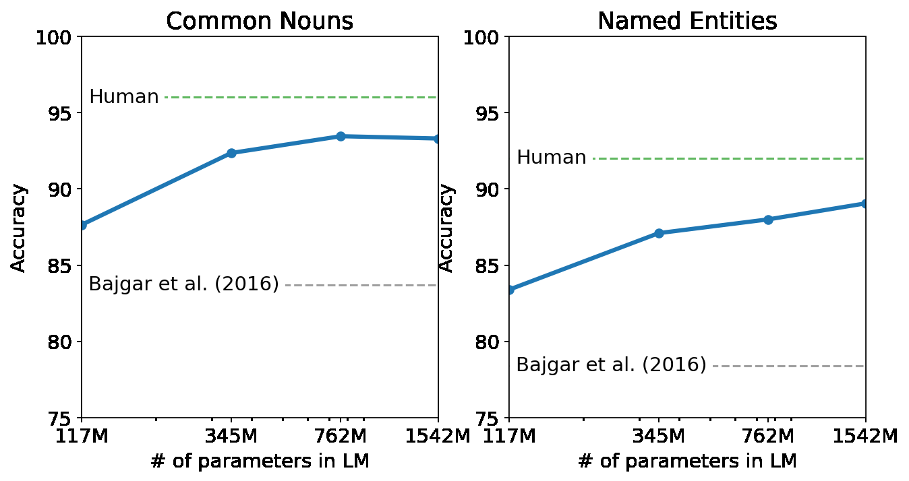
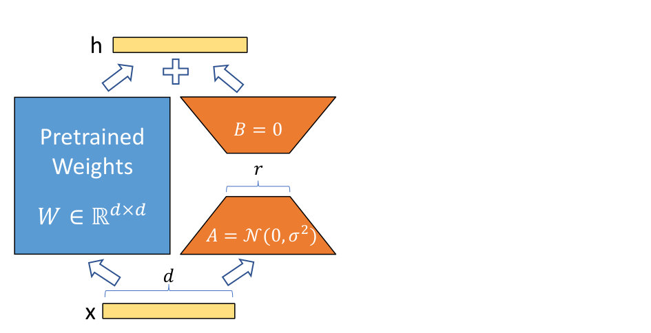

## 1. 多图并排

<!-- vml {"v":2,"rows":[{"height":190,"widths":[1.223,0.777],"captions":["微调方法参数量与准确率对比 {#fig:eval}","GPT-2 规模与零样本表现 {#fig:gpt2}"]}]} -->
 
<!-- /vml -->

- **调整图片宽度分配**：拖动两图之间的间隙线，调整宽度分配。
- **调整布局块尺寸**：拖动布局块底边调整高度，拖动布局块右下角等比缩放。
- **调整图片布局**：按住图片拖动可调换布局块内图片相对位置（左右上下），若图片所在行只有一张图片，可以横向拖动调整位置。
- **添加/编辑图注**：右键图片选择「编辑图注…」，修改文字与对齐。
- **布局块位置**：拖动布局块中部，可调整布局块位置。向左/右拖可调整布局块靠左/右。
---

## 2. 图文并排

<!-- vml {"v":2,"width":0.48,"valign":"center","rows":[{"width":1}]} -->

### 低秩自适应（LoRA）
冻结预训练权重 $W \in \mathbb{R}^{d \times k}$，引入低秩分解矩阵：
$$h = W x + \frac{\alpha}{r} B A x$$
其中 $B \in \mathbb{R}^{d \times r}, A \in \mathbb{R}^{r \times k}$，秩 $r \ll \min(d, k)$。
<!-- /vml -->

- **原地编辑**：点击右侧文字直接修改，按 `Esc` 退出。
- **垂直对齐**：右键图片可切换文字靠上、居中或靠底对齐。
- **添加文本框**：右键布局块内的文字可在左侧/右侧添加文本框。

---

## 3. 文字环绕

<!-- vml {"v":2,"width":0.3,"wrap":"right","type":"text","size":0.9} -->
**超参数配置**
- 秩 $r = 8$
- 缩放系数 $\alpha = 16$
- 优化器：AdamW
<!-- /vml -->
右键布局块可以选择文字环绕方式。

在大型语言模型微调中，低秩适应显著减少了可训练参数量。右侧卡片靠右浮动，正文在其左侧环绕，超出卡片高度后自动恢复全宽排版，保持版面紧凑。

---

## 4. 双栏排版与学术交叉引用

论文双栏排版，支持图表公式自动编号与点击跳转。

<!-- vml {"v":2,"type":"text","cols":2,"gap":1.5} -->
### 注意力机制

标准缩放点积注意力公式定义如下：

$$
\text{Attention}(Q, K, V) = \text{softmax}\left(\frac{QK^T}{\sqrt{d_k}}\right)V \label{eq:attn}
$$

如 @fig:eval 与 @fig:gpt2 所示，遵循 @eq:attn 的模型展现出优秀的扩展性。

### 模型参数对比

| 模型架构 | 隐藏层维度 | 注意力头数 |
| --- | ---: | ---: |
| Small (117M) | 768 | 12 |
| Medium (345M) | 1024 | 16 |
| Large (762M) | 1280 | 20 |

GPT-2 模型规格参数 {#tbl:arch}

参数详见 @tbl:arch。编辑时文字临时以单栏展开，退出后恢复分栏。
<!-- /vml -->

- **分栏设置**：右键文字布局块选择「文字设置…」，可切换 2~4 栏、调整栏距与对齐。
- **自动编号**：图注末尾加 `{#fig:标签}`，表注加 `{#tbl:标签}`，公式内加 `\label{eq:标签}`；正文用 `@fig:标签`、`@tbl:标签`、`@eq:标签` 引用，点击跳转。

---

## 5. 视频与动图混排

<!-- vml {"v":2,"rows":[{"height":190,"widths":[1,1],"captions":["注意力滑动窗口动画","模型结构对照"]}]} -->
 
<!-- /vml -->

- **视频手柄**：视频的拖拽手柄调整到左上角。
- **图片预览**：双击图片开启全屏预览，支持滚轮缩放与键盘左右键切图。

---

## 其他常用操作

| 操作       | 路径                              |
| -------- | ------------------------------- |
| **创建布局** | 选中内容 → 右键「把选中的内容包成布局块」（或使用快捷键）。 |
| **移出还原** | 右键「移出布局块」，或点击「编辑源码」删去注释。        |
