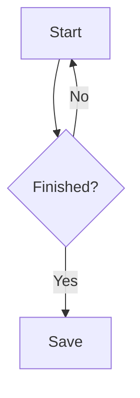
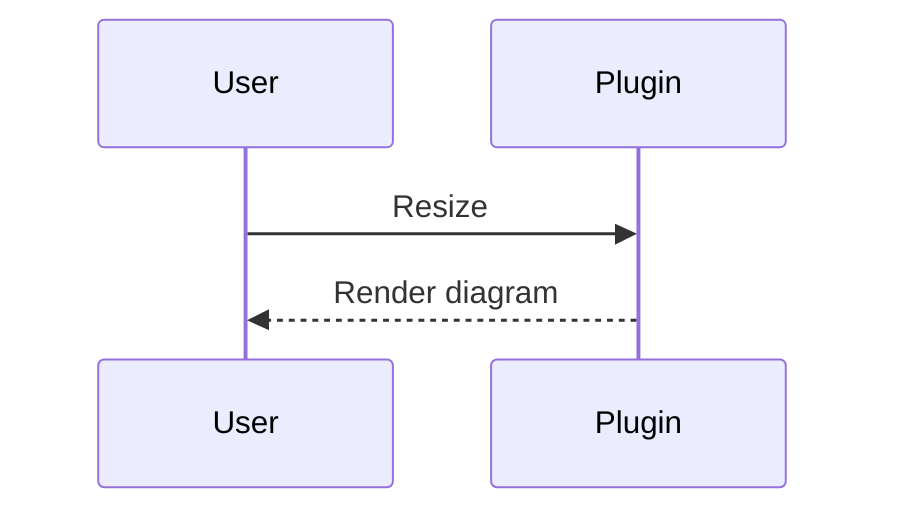

# Mermaid layout item examples

For the `codex/mermaid-layout` feature branch; this is not part of public 0.7.3. Diagrams can share a row. In Live Preview, drag dividers for column ratios, the bottom edge for row height, or diagrams to reorder them. Each diagram keeps its complete original Mermaid fence.

<!-- vml {"v":3,"kind":"media","rows":[{"items":2,"height":240,"widths":[1,1]}]} -->

<!-- /vml -->

In Live Preview, drag an ordinary Mermaid diagram directly into an existing layout, beside an image or another diagram. Press Esc before releasing, or drop outside a layout, to cancel. One undo restores both the diagram's original position and the destination layout.

You can also select a complete Mermaid fence and run "Wrap selection in a layout", including image or video lines in the selection. Drag a single item's side edge to resize its width. Use "Move out of layout" to restore an ordinary diagram.

Mermaid inside existing V2 text layouts keeps its original behavior. Edit diagram code in the note source; this feature does not include a diagram node editor.
