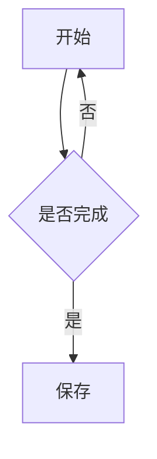
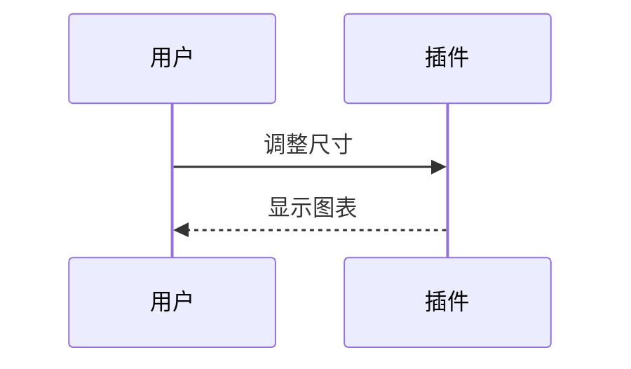

# Mermaid 独立布局项示例

仅供 `codex/mermaid-layout` 功能分支使用，未包含在公开 0.7.3。两张图表可以并排；实时预览中拖动分隔线调整比例、底边调整行高，拖动图表排序。图表源码始终保留为完整的 Mermaid 围栏。

<!-- vml {"v":3,"kind":"media","rows":[{"items":2,"height":240,"widths":[1,1]}]} -->

<!-- /vml -->

选中普通 Mermaid 的完整代码围栏，运行“把选中的内容包成布局块”，即可创建独立项。可与图片／视频一起选择，也可随后拖到图片旁边。单项布局拖动右侧边缘调整宽度；右键“移出布局块”恢复普通图表。

旧 V2 文字栏里的 Mermaid 保留现有行为。此功能不提供图表节点编辑器，修改图表内容仍在笔记源码中进行。
