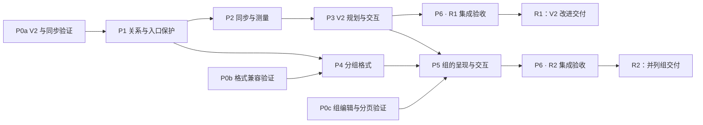

# 布局、拖动与视图同步改进实施方案

2026-10-10 分支整理：0.7.3 已提交推送并成为主目录基线；三视图和渲染修复整理为待合并分支，Android 手机／平板优先，真机验收按用户要求稍后进行。W02／W03 原未提交工作完整保留到另一工作树。当前分工、依赖、检查与恢复记录见 [36 工作树与 Android 优先交付](36-worktree-and-android-priority.md)。下方旧状态按原批次保留，当前交付分工以 36 为准。

更新日期：2026-10-10。本页是布局改进方案的索引；下方基线、工作包与依赖保留原规划范围。P0a 数据契约、P1 与 P2 协调／缓存基础已通过 [PR #12](https://github.com/Yi-luo-hua/obsidian-adjustable-media/pull/12) 合并并纳入 0.7.0，基础交付不等于完整 R1／R2 验收。该批历史验证见 [08 每窗格记录](08-pane-foundation-record.md)，规划后续见 [09 进度与后续安排](09-progress-and-next-steps.md)。

当前公开版本为 0.7.2；独立增量 0.7.3 手动文字分栏、点击修复与双语样例已完成本地发布准备，尚未公开发布。当前版本状态见 [项目状态](../../STATUS.md)，交付分类见 [28 分类与增量交付](28-incremental-delivery.md)，0.7.3 的范围、用户确认与验证见 [34 手动分栏](34-text-column-breaks.md)。它不表示最终布局规划器、移动适配或并列组已完成。

基线：`main` 的 `34f5896`（0.6.1），另含研究时已有的 `src/layout/placement.ts`、`tests/layoutWrap.test.ts` 未提交补偿；现已原样单独提交，见 09。基线研究见 [研究报告](../../research/LAYOUT_CONFLICTS.md)，其纯函数、独立浏览器证据与 Obsidian 实测范围分别记录，不互相替代。

目标是建立完整的布局关系和可实现位置规则，让拖动预览、写回后的呈现和实时预览／阅读视图一致。现有 Markdown 写入原则、原生正文输入、媒体与文字原文保留、一步撤销都属于必须保留的行为。

## 方案结构

| 文档 | 解决的问题 |
| --- | --- |
| [领域词汇](../../../CONTEXT.md) | 布局块、并列组、浮动集合、锚点、环绕范围的统一定义 |
| [01 模型与多维研判](01-model-and-decisions.md) | 约束、替代方案、推荐架构、场景判断与未知项 |
| [02 布局规划与拖动](02-planner-and-interactions.md) | 候选状态、碰撞规则、最终预览、写入及历史 |
| [03 视图同步与测量](03-view-sync-and-measurement.md) | 文档版本、窗格状态、缓存、虚拟呈现与收敛 |
| [04 并列组与格式](04-groups-and-format.md) | 组内交互、格式候选、迁移、旧版本行为与撤销 |
| [05 交付与验收](05-delivery-and-validation.md) | 工作包、依赖、PR 拆分、进入／退出条件及验收用例 |
| [二次核验与修订](06-plan-verification.md) | 八项实施缺口、源码反例、修订位置与剩余验证门槛 |
| [07 首批实施记录](07-execution-record.md) | P1 基础批次的代码与宿主证据 |
| [08 每窗格基础实施记录](08-pane-foundation-record.md) | 当前同步／缓存基础、双窗与延迟证据、剩余门槛 |
| [09 进度与后续安排](09-progress-and-next-steps.md) | 本批交付状态、下一批任务、依赖、退出条件与 PR 拆分 |
| [28 分类与增量交付](28-incremental-delivery.md) | 独立发布与其他工作线的范围、交付顺序和版本状态 |
| [34 手动文字分栏](34-text-column-breaks.md) | 0.7.3 的手动内容边界、点击修复、双语样例与发布准备 |

两项代价较高的推荐决策单独记录为 proposed ADR：[布局关系分层](../../adr/0001-explicit-layout-relations.md)、[分组格式的版本边界](../../adr/0002-versioned-flat-groups.md)。ADR 通过相应原型门槛后才转为 accepted。

## 多维研判后的实施取舍

1. **先改善现有 V2 的完整浮动规则和同步**。旧笔记获得改进不需要批量迁移，单独提供一个可验证的发布增量。
2. **并列组是明确的新增关系**。Grid 负责组内成员；左右浮动夹普通正文仍由浮动集合负责。相邻块不会因视觉上像一组而被自动写成新组。
3. **共享内容关系与求解规则，各窗格按自己的环境测量**。相同宽度和字体下对齐；不同宽度按同一意图重新排版，不复制屏幕坐标。
4. **把可实现性验证放到最前面**。正文高度会随避让变动，原生编辑器又有高度表。首个工作包须证明候选测量与实际宿主一致，不能靠额外补偿掩盖模型错误。
5. **新格式以版本边界和完整入口保护为共同前提**。二次核验已确认 0.6.1 基线的未知 V3 可被移除注释命令破坏；当前分支已补充 P1 保护与定向验证，R2 仍须完整入口及旧构建矩阵。不能承诺 0.6.1 基线及更早版本只读安全。
6. **ready 计划必须从最终源码读回**。共享规划同时提供只读依赖断言；测量中松手不延迟提交，纯滚动不清空有效尺寸缓存。

## 工作包与依赖

| 工作包 | 交付内容 | 依赖 | 建议拆分 |
| --- | --- | --- | --- |
| P0 | 分为 P0a 旧格式／同步、P0b 格式兼容、P0c 组编辑与导出验证 | 本规划 | 1–3 个验证 PR |
| P1 | 文档关系快照、运行期身份、依赖失效与未知格式入口保护 | P0a 数据契约 | 1 个基础模块 PR |
| P2 | 每窗格同步状态与环境测量缓存 | P1；P0a 测量验证 | 1 个同步 PR |
| P3 | 完整 V2 浮动规划、候选预览、统一操作入口 | P1、P2；P0a 可实现性通过 | 规划核心与交互接入各 1 个 PR |
| P4 | 并列组格式、读写与降级验证 | P1；P0b 格式探针 | 1 个格式 PR |
| P5 | 并列组在实时预览、阅读视图及导出中的呈现与交互 | P2、P3、P4；P0c 通过 | 呈现、组内交互各 1 个 PR |
| P6 | 每个准备交付增量的虚拟呈现、性能与发布验收 | R1：P1–P3；R2：P1–P5 | 每增量 1 个集成验收 PR |

P0a → P1 后推进 P2／P3；组格式和直接编辑的未知项留在 P0b／P0c，不能阻塞 R1。P4 还需 P0b，P5 等组相关前置包通过后开放创建／转换入口。该拆分描述工程依赖，不要求创建额外聊天或同时修改同一文件。

R1、R2 是两个可分别交付的增量：R1 对既有笔记改进规划与同步；R2 加入明确并列组。每个增量都需自己的完整集成验收，不将 P6 理解为等全部功能完成才测试。

## 文档与实现边界

- 已实施快照、依赖、入口与每窗格协调／缓存基础，并纳入 0.7.0。该批验证以 [实施记录](08-pane-foundation-record.md) 为准；后续独立版本以 [项目状态](../../STATUS.md) 和 [28](28-incremental-delivery.md) 为准，不能把独立功能发布视为完整生命周期、最终规划或组格式验收。
- [DESIGN.md](../../DESIGN.md) 描述当前实现。工作包验收合入时才逐项更新其存储格式、职责和行为记录。
- 较大实现改动在 `codex/` 独立分支进行。先核对现有未提交补偿是否纳入基线，不重置或混入无关改动。
- 合并、发布按项目既有规则及具体任务授权办理；每个工作包的完成证明需包含自动检查和对应宿主实测。
