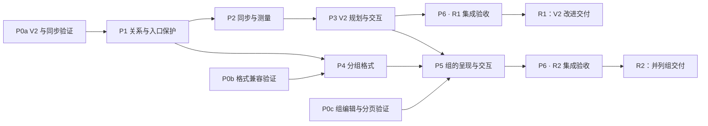

# 布局、拖动与视图同步改进实施方案

更新日期：2026-10-09。P0a 数据契约、P1 与 P2 协调／缓存基础已随 0.7.0 发布；W07 已随 [PR #20](https://github.com/Yi-luo-hua/obsidian-adjustable-media/pull/20) 合入 `main`（`ce4124a`，未发布）。W08 已本地验收，W01 Windows 已列生命周期门槛通过，W09 Android 基线及平板已列输入／显示场景通过；最新视频播放／暂停／角落缩放经用户手指复核通过，最新自动检查 407 项（[20–24 记录索引](25-documentation-and-artifact-cleanup.md)）。W02 仅实现源码候选，几何与预算未验收；P3–P6、统一触摸规划器、完整 W10／W11 和 R1／R2 仍待推进，iOS 按用户要求暂缓。当前增量本地提交至 `codex/android-layout-stability`，未合并／发布，正式 manifest 仍仅桌面端。当前状态与任务队列见 [09](09-progress-and-next-steps.md)。

规划的研究基线是 `main` 的 `34f5896`（0.6.1），见 [研究报告](../../research/LAYOUT_CONFLICTS.md)；其纯函数、独立浏览器证据与 Obsidian 实测范围分别记录，不互相替代。此后的代码变化以 09 第 1 节为准。

目标是建立完整的布局关系和可实现位置规则，让拖动预览、写回后的呈现和实时预览／阅读视图一致。现有 Markdown 写入原则、原生正文输入、媒体与文字原文保留、一步撤销都属于必须保留的行为。

## 方案结构

| 文档 | 解决的问题 |
| --- | --- |
| [领域词汇](../../../CONTEXT.md) | 布局块、并列组、浮动集合、锚点、环绕范围的统一定义 |
| [01 模型与多维研判](01-model-and-decisions.md) | 约束、替代方案、推荐架构、场景判断与未知项 |
| [02 布局规划与拖动](02-planner-and-interactions.md) | 候选状态、碰撞规则、最终预览、写入及历史 |
| [03 视图同步与测量](03-view-sync-and-measurement.md) | 文档版本、窗格状态、缓存、虚拟呈现与收敛 |
| [04 并列组与格式](04-groups-and-format.md) | 组内交互、格式候选、迁移、旧版本行为与撤销 |
| [05 交付与验收](05-delivery-and-validation.md) | 工作包、依赖、PR 拆分、进入／退出条件及验收用例 |
| [二次核验与修订](06-plan-verification.md) | 八项实施缺口、源码反例、修订位置与剩余验证门槛 |
| [07 首批实施记录](07-execution-record.md) | P1 基础批次的代码与宿主证据 |
| [08 每窗格基础实施记录](08-pane-foundation-record.md) | 当前同步／缓存基础、双窗与延迟证据、剩余门槛 |
| [09 进度与任务队列](09-progress-and-next-steps.md) | 当前状态、待办任务（W01–W11）、进入／退出条件与执行约定 |
| [10 宿主段落分块首批记录](10-host-paragraph-boundary-record.md) | W07 首批实现与热态性能的历史证据；后续验收见 11 |
| [11 宿主段落分块验收](11-host-paragraph-boundary-acceptance.md) | W07 最终构建的列表内部、真实输入、启动／索引队列和三视图验收 |
| [12 段落间距审查修复](12-paragraph-spacing-review-fixes.md) | Setext H1 与引用定义的修复、15 个宿主回归场景与最终检查 |
| [13 边框高亮与手机适配](13-highlight-and-mobile-plan.md) | 新选项的光标语义、手机平台验证／显示输入／触摸操作及执行顺序 |
| [14 边框高亮实施记录](14-highlight-execution-record.md) | W08 默认开启、真实输入与设置／PDF 验收 |
| [15 手机平台源码审计](15-mobile-platform-audit.md) | W09 能力风险、待真机矩阵与后续步骤 |
| [16 桌面生命周期记录](16-lifecycle-execution-record.md) | W01 测量通知、旧令牌与首次中段修复，实际验证范围 |
| [17 首轮暂停记录](17-w01-and-android-continuation.md) | W01 补测与 Android 首轮问题的历史快照 |
| [18 Android 与 W01 续测验收](18-android-and-w01-acceptance.md) | 最终构建、剩余桌面门槛、手机输入与滚动修复、恢复及未覆盖范围 |
| [19 W10、W02 与平板续作](19-w10-w02-and-tablet-continuation.md) | 移动输入按钮、实际 edits 的源码候选、平板分屏矩阵与用户延期测试的恢复点 |
| [20 平板真机验收](20-tablet-acceptance.md) | Huawei 11.5S 原生输入、旋转、宽表格、软键盘操作栏与剩余矩阵 |
| [21 移动触摸修复](21-mobile-touch-interaction-fixes.md) | 普通点击误展开源码、布局横向带侧栏冲突、把手裁切及阅读切换修复 |
| [22 角落把手与输入禁区](22-mobile-corner-input-guard.md) | 右下角完整触摸按钮、邻近文字输入禁区、拖动结束误点击与真机取消回归 |
| [23 视频缩放保留播放器](23-video-resize-player-preservation.md) | 尺寸写回后原位更新、连续缩放／历史／浮动替身播放连续性 |
| [24 移动视频控件与焦点](24-mobile-video-controls-focus.md) | 原生控件事件隔离、尺寸写回不唤起输入栏、最新真机回归 |
| [25 文档与产物整理](25-documentation-and-artifact-cleanup.md) | 最新验收范围、剩余门槛、可恢复清理与保留产物 |

两项代价较高的推荐决策单独记录为 proposed ADR：[布局关系分层](../../adr/0001-explicit-layout-relations.md)、[分组格式的版本边界](../../adr/0002-versioned-flat-groups.md)。ADR 通过相应原型门槛后才转为 accepted。

## 多维研判后的实施取舍

1. **先改善现有 V2 的完整浮动规则和同步**。旧笔记获得改进不需要批量迁移，单独提供一个可验证的发布增量。
2. **并列组是明确的新增关系**。Grid 负责组内成员；左右浮动夹普通正文仍由浮动集合负责。相邻块不会因视觉上像一组而被自动写成新组。
3. **共享内容关系与求解规则，各窗格按自己的环境测量**。相同宽度和字体下对齐；不同宽度按同一意图重新排版，不复制屏幕坐标。
4. **把可实现性验证放到最前面**。正文高度会随避让变动，原生编辑器又有高度表。首个工作包须证明候选测量与实际宿主一致，不能靠额外补偿掩盖模型错误。
5. **新格式以版本边界和完整入口保护为共同前提**。二次核验已确认 0.6.1 基线的未知 V3 可被移除注释命令破坏；当前分支已补充 P1 保护与定向验证，R2 仍须完整入口及旧构建矩阵。不能承诺 0.6.1 基线及更早版本只读安全。
6. **ready 计划必须从最终源码读回**。共享规划同时提供只读依赖断言；测量中松手不延迟提交，纯滚动不清空有效尺寸缓存。

## 工作包与依赖

| 工作包 | 交付内容 | 依赖 | 建议拆分 |
| --- | --- | --- | --- |
| P0 | 分为 P0a 旧格式／同步、P0b 格式兼容、P0c 组编辑与导出验证 | 本规划 | 1–3 个验证 PR |
| P1 | 文档关系快照、运行期身份、依赖失效与未知格式入口保护 | P0a 数据契约 | 1 个基础模块 PR |
| P2 | 每窗格同步状态与环境测量缓存 | P1；P0a 测量验证 | 1 个同步 PR |
| P3 | 完整 V2 浮动规划、候选预览、统一操作入口 | P1、P2；P0a 可实现性通过 | 规划核心与交互接入各 1 个 PR |
| P4 | 并列组格式、读写与降级验证 | P1；P0b 格式探针 | 1 个格式 PR |
| P5 | 并列组在实时预览、阅读视图及导出中的呈现与交互 | P2、P3、P4；P0c 通过 | 呈现、组内交互各 1 个 PR |
| P6 | 每个准备交付增量的虚拟呈现、性能与发布验收 | R1：P1–P3；R2：P1–P5 | 每增量 1 个集成验收 PR |

P0a → P1 后推进 P2／P3；组格式和直接编辑的未知项留在 P0b／P0c，不能阻塞 R1。P4 还需 P0b，P5 等组相关前置包通过后开放创建／转换入口。该拆分描述工程依赖，不要求创建额外聊天或同时修改同一文件。

R1、R2 是两个可分别交付的增量：R1 对既有笔记改进规划与同步；R2 加入明确并列组。每个增量都需自己的完整集成验收，不将 P6 理解为等全部功能完成才测试。

## 文档与实现边界

- 快照、依赖、入口与每窗格协调／缓存基础已发布；W01 Windows 已列生命周期门槛通过，候选契约、最终规划和组格式仍属于后续工作，格式仍为 V2，未迁移笔记。
- [DESIGN.md](../../DESIGN.md) 描述当前实现。工作包验收合入时才逐项更新其存储格式、职责和行为记录。
- 较大实现改动在独立分支进行，不重置或混入无关改动。
- 合并、发布按项目既有规则及具体任务授权办理；每个工作包的完成证明需包含自动检查和对应宿主实测。
