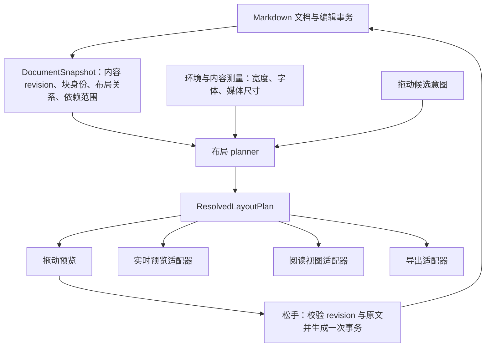

# Adjustable Media：并列、拖动与双视图同步的设计研究

> 项目归档：2026-09-30。第 1–6 节记录初次研究的代码、纯函数与独立浏览器证据；第 7 节记录转写实施方案前的补充研判。文中的“当前”指研究基线。后续已实施 P1 与 P2 协调／缓存基础，见 [08 实施记录](../plans/layout-redesign/archive/08-pane-foundation-record.md) 与 [09 进度安排](../plans/layout-redesign/09-progress-and-next-steps.md)。当前实现以 [DESIGN.md](../DESIGN.md) 为准；新组格式和最终规划器仍是候选。
>
> 证据附件：[可执行基线探针](LAYOUT_PROBES.md)、[独立浮动实验页](float-model-lab.html)、[测量结果 JSON](layout-study-evidence.json)。

日期：2026-09-30。研究对象：main，HEAD `34f5896`，版本 0.6.1，并包含研究时已有的 `placement.ts`、`layoutWrap.test.ts` 未提交改动。研究阶段未修改插件源码或测试库笔记；后续实现与证据分批记录，不用新实现倒改基线反例。

核心判断：当前数据模型表达了单个块的宽度、左右浮动和错行，却没有表达“哪些块属于一个并列布局”“块相对于什么正文锚点定位”“碰撞后实际允许落在哪里”。这些关系由源码相邻、CSS 浮动和 DOM 测量共同推断。拖动预览又独立计算一个矩形，阅读视图另行维护浮动替身，因此一份设置可能在三处获得不同的位置解释。继续增加邻块补偿，难以建立完整的布局规则。

## 1. 当前机制及其根本矛盾

当前流程是：Markdown → V2Block → 每块 LayoutModel → CSS float → CodeMirror／阅读视图各自补偿高度。一次拖动先算 `Placement {line, wrap, skip}`，松手后才调用 `planPlacement` 重排源码、补偿邻块。

`skip` 在存储里看起来是单块的属性，但它的含义依赖关系：

- 只有一个浮动时，是自己的错行。
- 相邻异侧浮动时，从隐含的共享锚点计数；渲染要减去之前的错行。
- 后块的值小于前块时，计算会把后块值累加到已有位置。
- 相邻同侧浮动时，`floatOrder.ts` 重新开始计数，但 CSS 的 `clear: left/right` 仍要求后块排在前面同侧块的底部之后。

所以 `visualWrapSkip()` 并不是所有排列情况下的真实显示位置函数：它不接收块高、块宽、文字宽度或前面同侧浮动的结束位置。实际浏览器却依赖这些信息。CSS 还要求后出现的浮动不能高于前面的浮动，`clear` 会增加同侧底边约束，见 [W3C CSS 2.2 §9.5.1–9.5.2](https://www.w3.org/TR/CSS22/visuren.html#float-position)。

代码依据：[floatOrder.ts](../../src/layout/floatOrder.ts#L41)、[浮动样式](../../styles.css#L760)。

## 2. 已验证的问题

### 2.1 多块关系无法用一次邻块交换表达

纯函数案例：A 左 skip=2，B 右 skip=4，C 左 skip=6，三块仅以空行相隔。

| 操作意图 | 当前写回顺序 | 当前模型的 visual skip |
| --- | --- | --- |
| C 拖到 skip=1 | A → C → B | A=2，C=1，B=5 |
| A 拖到 skip=8 | B → A → C | B=5，A=8，C=6 |

`orderAdjacentFloat()` 只看紧邻异侧块。第一个操作没有越过 A；第二个操作没有继续处理 C。生成的“视觉顺序”随后撞上同侧 `clear` 约束。

我将当前 `float / clear / margin / skip` 的核心样式复制到独立实验页，使用零高度锚点、24px 行高、120px 块高和约 1000px 容器。浏览器测量如下；“预测”是当前 visual skip × 24px + 4px 上外边距。亚像素缩放造成约 0.5px 的基准差异不影响结论。

| 场景 | 块 | 预测顶端 | 浏览器顶端 |
| --- | --- | --- | --- |
| A → C → B，上移 C | C | 28px | 183.53px |
| A → C → B，上移 C | B | 124px | 279.53px |
| B → A → C，下移 A | C | 148px | 339.54px |

这是底层 CSS 约束与计算模型不一致的直接证据。它说明需要先求解整个相关布局的可实现位置，才能给用户落点。它不证明这些像素值会原样出现在 Obsidian。

代码依据：[placement.ts](../../src/layout/placement.ts#L107)。可交互实验见 [独立浮动实验页](float-model-lab.html)。

### 2.2 移出、换侧、取消环绕没有一致的关系更新语义

纯函数案例：A 左 skip=4，B 右没有 skip。当前模型认为 B 从共享锚点的第 4 行开始。把 A 移到文末，B 的元数据没有补偿，模型里的 B 起点变成第 0 行。

当前补偿限定于“同一位置、同一浮动方向”的若干情形。移出原组合、切换方向、移入另一组和菜单取消环绕没有统一的依赖更新。菜单直接 `setWrap → planModelEdit`，绕过整块拖动中的关系规划。

这并不意味着所有操作都应把其他块锁在旧屏幕像素上。拖走占据正常文档高度的块，后面的内容本来就该上移。需要明确定义的是：保留邻块相对于正文锚点的意图；只有碰撞规则要求的相邻块发生位移；界面提前展示这些受影响位置。

代码依据：[placement.ts](../../src/layout/placement.ts#L145)、[菜单改环绕](../../src/view/interactions.ts#L758)。

### 2.3 预览没有验证最终计划，宽度也没有联合求解

拖动预览使用旧文档的 gap 坐标、一个默认行高以及当前块的宽高推算，直到松手才调用 `planPlacement()`。它没有模拟源块移除之后的目标坐标、最终源码排序、相邻浮动碰撞或正文剩余宽度。

独立 CSS 实验中，左右两块都宽 60%，模型都预测在约 4px 顶端；实际右块在约 135.54px，因为横向放不下。当前宽度限制只对单块设 80% 上限，并未约束左右块宽度之和、外边距和正文最小宽度。

另一个纯函数边界案例：A 左 skip=40，B 右无 skip，把 B 拖到第 2 行，邻块的固定 `+1` 补偿需要 41，`planPlacement()` 返回 null。预览阶段没有调用这个检查，松手分支也没有提示该计划不可实现。这是“预览显示可放，松手却无结果”的确定路径。

预览框高度还按宽度比例缩放，再截到 48–360px。文字块变窄通常变高；多图行可能保持固定行高。这种估计可用于拖动缩略影像，却不适合作为最终占位承诺。

代码依据：[blockDrag.ts](../../src/view/blockDrag.ts#L84)、[wrappedDrop](../../src/layout/geometry.ts#L161)、[补偿上限](../../src/layout/placement.ts#L146)。

### 2.4 阅读视图的失效判断漏掉布局关系变化

纯函数案例：两个相邻异侧块 A skip=2、B skip=4。B 的 effective skip=2。把中间的空行换成普通正文，B 的 effective skip 变成 4；然而 `isStale(drawnFrom(before), drawnFrom(after))` 返回 false。

原因是 `Drawn` 只记录布局注释、栏内文字和引用编号，没有记录块间正文、相邻关系、位置和 effective skip。实时预览会对文档变化重新计算装饰；阅读视图却依赖 Obsidian 重用原来未变化的段落，因此此处没有主动重绘旧布局的信号。纯函数已确认失效判断漏报；具体阅读窗格何时表现成错位，仍需 Obsidian 双窗测试。

另外，阅读视图的记录按文件路径共享，不能表达“窗格甲已画到 revision 12、窗格乙还停在 revision 11”。`metadataCache.changed` 分支在真正完成绘制之前就把记录更新为 current；重绘只进行五次、每次 100ms 的内容匹配重试。如果主视图迟于这个窗口更新，没有可靠的完成确认。这里属于已检查代码的同步设计风险，本轮未复现其时序。

代码依据：[drawn.ts](../../src/layout/drawn.ts#L17)、[readingView.ts](../../src/view/readingView.ts#L152)。

### 2.5 两种视图各自维护一套几何补偿

实时预览是零高度锚点、wrap gap、按视口插入替身；阅读视图是分段高度、隐藏替身、离屏复制测量、重新请求 Obsidian 测量。共享了 `renderLayout` 和 `planProxy`，但没有共享最终的完整布局计划。

这两种宿主的虚拟渲染机制本来不同，需要适配器。问题是当前适配器也承担了位置规则：例如阅读视图的离屏规划记住同侧浮动的结束位置，而拖动的 skip 模型没有对应的信息。显示范围变化、块宽变化和媒体加载就可能重新暴露不一致。

源码依据：[wrapGuard.ts](../../src/view/wrapGuard.ts#L175)、[readingWrap.ts](../../src/view/readingWrap.ts#L228)。设计文档也保留了未完全消除的阅读视图跳动记录：[DESIGN.md 第 4.1 节](../DESIGN.md#41-文字环绕)。这些历史记录不作为本轮新实测。

### 2.6 块身份和测量环境没有明确分开

浮动尺寸缓存以块的完整原文作为身份；相同原文的两个块可能共用一个尺寸记录。非浮动高度缓存使用“完整原文”及“文件路径 + 开始行”，没有宽度、字体环境和窗格身份。相同笔记在宽窄两个窗格中打开时，高度不是同一个量；上方插入正文后，开始行也不再是稳定身份。

这属于源码确认的架构风险，本轮未做多窗格缓存污染复现。新增层次时应直接消除这种身份与位置、测量值混用的设计。

代码依据：[浮动缓存](../../src/view/wrapGuard.ts#L245)、[高度缓存](../../src/view/livePreview.ts#L200)。

## 3. 建议的底层模型

建议同时引入明确的布局关系与共享的布局规划。只把现有 float 换成 Grid，不能解决普通正文跨段环绕；只抽出共享函数，也不能补出当前缺失的关系数据。

### 3.1 将三类关系分别表达

| 对象 | 表达的用户意图 | 渲染责任 |
| --- | --- | --- |
| LayoutBlock | 一个媒体块、文字块或已有图文栏 | 内容、内部行列、尺寸 |
| ParallelGroup | 几个独立块属于同一行／组，列宽和间距怎样分配 | 在组内用 Grid/Flex 处理并列；组作为一个可测量单元 |
| WrapPlacement / FlowRegion | 块或组相对于哪段正文开始环绕、靠哪一侧、偏移多少、影响到哪里 | 计算外部浮动和正文避让，处理碰撞及宿主虚拟渲染 |

并列组不等于把两个块的媒体和文字拼成一个现有 V2 块。组保存各成员的身份、原文范围、内容模型和组内布局；成员仍可单独编辑、拖出或移动整组。并列布局可获得完整的组高度，不再让成员通过两个隐含的零高度锚点互相推挤。

环绕仍支持用户当前的正文编辑习惯。普通正文保持 Markdown 与原生编辑，FlowRegion 首先是解析和规划产生的逻辑范围，不要求包进新的文字栏或另开编辑器。边界可由明确的目标段、分隔布局和用户选择确定。是否开放显式的环绕结束设置，可在实现原型后决定。

对新关系采用稳定块 ID 和明确成员引用；旧笔记先在内存中获得运行期身份，不因渲染而写文件。用户创建新组或明确迁移时，才把必要身份和组关系写入注释。新格式及旧版兼容策略需要单独确认，本文不把格式草案当成已定规范。已有 `v:2` 的嵌入和文字无需全文转换。

### 3.2 统一“希望放哪里”与“实际放哪里”的求解

拖动先产生意图，例如“移到段落 P 左侧，向下偏移 3 个正文行高”，或者“加入组 G 的第 2 列”。由同一 planner 计算：

1. 源组／源位置移除后，目标锚点的位置与受影响范围。
2. 目标组的列宽、组高、是否需换行；正文环绕的横向可用宽度。
3. 同侧堆叠、异侧宽度冲突、源码／宿主的可实现顺序。
4. 最终块矩形、影响到的其他块、文档高度变化及写入计划。

planner 的输入包含相关范围内的全部块、明确关系、宿主测量值及环境；输出是 `ResolvedLayoutPlan`。单块 skip 函数不能独立决定最终位置。

拖动框、松手提交、菜单切换环绕和渲染，都使用这套计划。若必须下移、换行或影响邻块，预览直接显示求解后的结果；无可实现落点时显示不可放置原因。保持原块布局用于定位，同时测量临时移除源块后的候选状态，避免目标仍带着源块原来的占位。

为了避免指针每移动一点就全篇渲染，开始手势时冻结文档 revision 与相关范围；随后只重算候选组和依赖它的范围。跨过区域边界或布局环境改变时更新测量。碰撞计算需要浏览器测量协助，不能声称一个不含正文测量的纯数学函数可以完全替代 Markdown 排版。

固定 `+1` 补偿应逐步由明确的锚点转换取代。新偏移描述相对于明确正文锚点的行高距离，不混合“自己的错行”和“继承前块的显示高度”。旧 skip 的含义保留在兼容解析器中。

### 3.3 把测量、求解与绘制分成可收敛的步骤

- **测量**：取得内容尺寸、正文段落高度和环境。每条结果带文档 revision、可用宽度、字体／样式环境、媒体尺寸状态；旧结果不能覆盖新环境。
- **求解**：依据这些结果计算约束和可实现位置。以文档顺序推进正文影响范围，避免后块反过来修改前块的锚点形成循环。
- **绘制**：适配器安装块、组与必要占位；检查实际矩形是否符合计划。差异有变化才触发下一次测量，不把布局规则藏进无休止的 DOM 修正。

测量缓存的键应是“稳定块身份 + 内容 revision + 宽度／字体环境 + 渲染状态”，位置另外保存。不要把屏幕像素写入笔记；持久化的仍是相对布局意图，确保换窗格宽度、换字体和导出时能重新排版。

## 4. 实时预览与阅读视图的同步设计

同步应覆盖两件事：同一份内容与布局意图；相同环境下的一致排版。不同宽度的窗格自然会产生不同换行与像素坐标，应维持相同关系和求解规则。

### 4.1 以文档快照作为内容依据

源编辑器成功提交事务后形成新文档快照，通知显示同一文件的窗格；外部文件修改同样形成新快照。布局关系、块间普通正文、媒体、栏内文字和引用变化，都进入依赖失效判断。拖动中的候选状态仅在发起窗格中显示，松手成功后才成为其他视图订阅的状态。

现有原文校验和唯一写入入口应保留。ID 用于跟踪身份，不能替代写入前的原文确认。出现并发修改时中止或重新规划，不能用旧 DOM 坐标猜位置写回。

### 4.2 每个窗格分别确认已画到哪个 revision

区分 `desiredRevision`、`renderedRevision` 和 `measuredRevision`。请求重绘并不代表重绘完成；阅读视图真正应用了对应内容和计划后，才推进 renderedRevision。旧异步任务、旧媒体加载回调和旧测量不能把已经更新的窗格退回旧状态。

Obsidian 自己的正文仍由其 Markdown 视图同步，不能让插件在宿主正文还是旧版本时，只把布局画成新版本。宿主 `getViewData()` 尚未匹配目标快照时保留待应用 revision，在视图加载／内容更新后继续；新 revision 到达就合并过期任务。同步生命周期不应依赖“500ms 内碰巧更新完”的固定重试窗口。

### 4.3 两种宿主保留适配层，位置规则只保留一份

实时预览适配 CodeMirror 的高度表、选择映射和原生输入；阅读视图适配段落生命周期、折叠、离屏呈现与 Obsidian 重新测量。这些机制不同，不能共享一个 DOM 实例或一套屏幕坐标，但必须使用同一份块关系和可实现布局规则。

优先让并列组成为完整的渲染／测量单元。对真正跨段环绕的浮动，再保留受控的替身机制。Obsidian 未公开的阅读视图 API 集中在适配器；不可用时明确降级到可靠的重绘或限定呈现，不让整个布局模型依赖内部字段存在。

## 5. 实施顺序与验收

建议先在独立分支做一个最小架构原型，沿用现有格式解析与写回代码：

1. **文档关系快照与统一规划**：先覆盖旧 V2、完整相关浮动集合、菜单与拖动同一入口、预览最终计划、双视图的 revision 和依赖失效。这里已经能消除不少结构性冲突。
2. **明确并列组**：证明媒体块与文字块可并列、可拖出、可整体移动；采用单个可测量组，验证组内编辑和源码展开的选择映射。原型通过后再定持久化格式与兼容行为。
3. **两种适配器及环绕收敛**：统一环境缓存与替身计划，覆盖媒体晚加载、长笔记、宽窄双窗及视口移出再进入。

| 验收维度 | 必须验证的性质 |
| --- | --- |
| 拖动结果 | 可实现预览与松手后矩形一致；不可实现落点在预览中说明 |
| 多块关系 | 2–4 块、同侧／异侧混排、宽度放不下、跨越多个块；求解结束后无违规碰撞 |
| 操作一致 | 拖入／拖出、换侧、取消环绕、菜单改变宽度，遵守同一组关系与碰撞规则 |
| 邻块影响 | 无关系变化且无碰撞时保持正文锚点意图；需要移动时预览显示受影响块 |
| 数据完整 | 嵌入原文、栏内文字与非目标 Markdown 逐字保留，CRLF 保持，读取失败的块不写入 |
| 历史与并发 | 一次手势一步撤销；撤销／重做恢复关系；文档改动后旧计划不写入 |
| 双视图 | 两个阅读窗格和源窗格分别确认最新 revision；改块间正文也刷新相关布局 |
| 环境变化 | 同宽同字体下排版一致；不同宽度合理重排；晚加载媒体不会应用旧计划 |
| 虚拟渲染 | 跳到长浮动中段、离屏再返回、后台测量、标题折叠；高度表与可见矩形一致 |
| 收敛 | 无新内容、环境或测量变化时，规划／补偿停止；不能持续 dispatch 或重测 |

测试应该先验证这些性质，再加入特定回归案例。现有若干测试名称写“保持屏幕位置”，实际只断言元数据和 skip 值，无法发现表 2.1 的 CSS 排版偏差。

## 6. 本轮验证范围

- Node 24.11.1；`npm run check` 通过类型检查、lint 和 206 个单元测试。
- 额外运行只读纯函数探针（[基线探针](LAYOUT_PROBES.md) 可重复执行），验证三块排序、移出邻块、换侧、skip 上限，以及块间正文改变时的阅读失效漏报。
- 在 Codex 内置浏览器执行了独立 CSS 实验，实际测量四组排列和宽度冲突；实验只依赖本地文件，无外部脚本。
- 本轮没有运行中的 Obsidian 实例，因此没有进行真实 Obsidian 拖动、双窗同步或虚拟滚动验收。本文明确区分纯函数证据、独立浏览器证据与待做的宿主验证。
- 初次研究时，仓库的两个原有未提交文件保持原状，报告与实验页仅存于输出目录。随后按用户要求将研究及证据归档到项目文档；本次归档仍未实现规划中的插件功能、未提交、未发布。

## 7. 实施规划前的补充研判

### 7.1 五个维度的修订结论

| 维度 | 深入判断 | 对实施的影响 |
| --- | --- | --- |
| 用户内容归属 | 现有媒体行、文字栏、明确并列组、左右浮动夹正文是不同需求 | 保留内部模型；Grid 仅负责组内；普通正文保持原生编辑 |
| 宿主可实现性 | 文字高度随宽度和避让改变；CodeMirror 与阅读视图呈现机制不同 | P0 先证明候选测量，不用独立 HTML 代替宿主验收 |
| 数据与历史 | 跨块关系不应扩大成全文重写；组操作有多个明确目标 | 平坦成员、目标 opener、原样搬运、一次事务与精确原文校验 |
| 兼容性 | V2 未知字段保留不等于旧版理解跨块关系 | 首选版本边界；代表性旧构建逐入口验证 |
| 同步与性能 | 内容更新、环境变动和异步测量不能仅以文件路径共享状态 | 每窗格确认版本、范围与环境；建立正确性后再缩小失效范围 |

完整取舍、未知项及验收门槛分别见 [模型与多维研判](../plans/layout-redesign/01-model-and-decisions.md)、[交付与验收](../plans/layout-redesign/05-delivery-and-validation.md)。

并列组作为实心的完整渲染单元，只能统一其内部成员；普通正文不能自然从该单元的中间穿过。首版组因此限定在正常文档流，组整体浮动及嵌套另行验证。这里收紧了第 3 节广义“块或组环绕”的候选范围，避免将未来能力混入第一阶段。

### 7.2 格式保护的纯函数证据

补充探针对当前 findV2Blocks、isDrawable、isEditable、setWrap 与 planModelEdit 检查：

| 输入 | 解析／编辑结果 | 解释 |
| --- | --- | --- |
| V2 增加 id、groupId、groupLayout | 可绘制、可编辑，设置编辑仍能生成写入计划 | 旧逻辑可能改变成员而不更新组关系 |
| 同一普通块改 v:3 | 可绘制、不可编辑，metaError 为不支持版本，编辑计划为 null | 当前解析器具备未知版本的写入保护 |
| V3 外层包普通 V2 | 内部 V2 被识别且可编辑 | 外层 wrapper 无法保护成员 |

二次核验补充：上表只证明 V3 普通模型编辑返回 null。当前 `planUnwrap` 没有 isEditable 检查，单块移除注释命令和批量命令直接调用它；即使块不可编辑，纯函数／memoryEditor 仍成功移除注释和组元数据。当前基线因此不具备完整只读边界，不能以版本号单独承诺旧版安全。

R1 先补齐统一入口保护；R2 仅向实测的保护构建声明安全降级，不能修改用户已经安装的旧插件。无插件仍可阅读普通 Markdown，但组样式丢失。建议格式、支持范围及门槛见 [分组格式方案](../plans/layout-redesign/04-groups-and-format.md)。

### 7.3 双视图的完成定义

同一文件的内容快照可协调，各窗格的环境和呈现完成状态分别确认。虚拟视图的版本必须附带已呈现范围；宿主正文尚未匹配时，布局保持 pending。另一源窗格有未同步内容时，不用 setViewData 强行覆盖；插件不替代 Obsidian 的内容同步机制。

实时预览的块装饰通过可影响垂直布局的直接 decoration set 提供；布局测量遵循 requestMeasure 的读取和写入阶段。依据为本仓库锁定依赖的 @codemirror/view 类型声明，阅读参考 [CodeMirror 官方 API](https://codemirror.net/docs/ref/#view.EditorView.requestMeasure)。Obsidian 的公共事件参考 [官方 API 声明](https://github.com/obsidianmd/obsidian-api/blob/master/obsidian.d.ts)，具体事件顺序与内部呈现确认仍待 P0 实测。

## 8. 转写为实施方案

研究分为两个可验收增量：R1 改善既有 V2 的浮动规划、拖动预览与双视图同步；R2 引入明确并列组。P0–P6 工作包及依赖、语义测试、真实宿主场景、格式兼容与发布门槛集中在 [实施方案入口](../plans/layout-redesign/README.md)。

本报告中的纯函数结果刻画当前缺陷；修复后应该改变错误结果，而不是继续让基线探针通过。独立浏览器像素记录是 CSS 机制证据，真实 Obsidian、中文输入法、双窗、虚拟滚动及 PDF 的结果须在后续工作包单独记录。

2026-09-30 二次核验记录见 [方案核验与修订](../plans/layout-redesign/archive/06-plan-verification.md)。此次补上了完整入口保护、独立只读依赖断言、最终源码读回、松手结束规则、来源／测量隔离及增量交付依赖；这些是实施契约的修订，没有修改插件实现。
